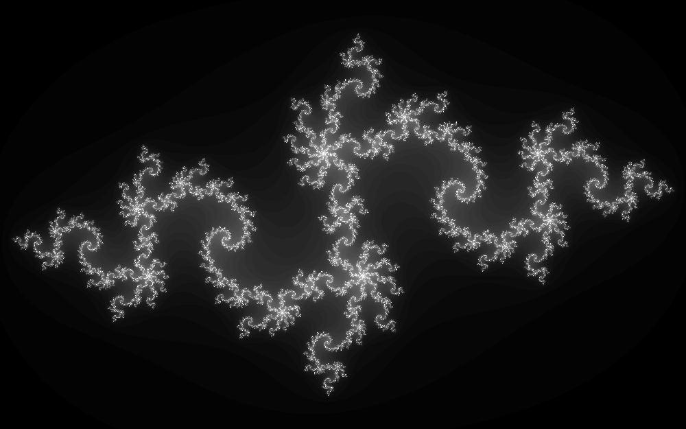
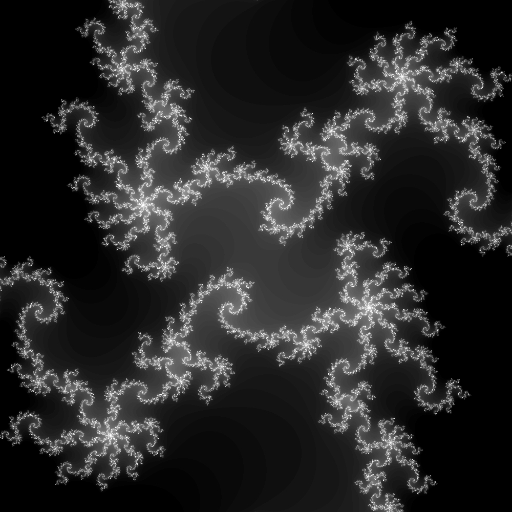

+++
title = "Speed up a Python program with Rust"
date = 2022-12-24
[taxonomies]
categories = ["Programmation", "Mathematics"]
tags = ["Python", "Rust", "Julia sets"]
+++

In this entry, I showcase how to use Rust to do the legwork in a Python
program.  I focus on the calculation of [Julia sets
representations](https://en.wikipedia.org/wiki/Julia_set), as this problem
provides plenty of eye-candy to lure the innocent reader.

# Julia sets

I focus here on the filled Julia set associated with the following complex
quadratic polynomial:

$$f(z) = z^2 + c_0$$

where $z$ is a complex number and $c_0$ a fixed complex parameter.  The filled
Julia set associated with $c_0$ is the set of $z_0$ such as the sequence

$$z_{n+1} = f(z_n) = z_n^2 + c_0$$

does not diverge.  A common way to represent those sets is to apply the
sequence a few tens or hundreds of times to a region of the complex plane and
map how many iterations it takes for the sequence to diverge beyond a chosen
magnitude.  This is what it looks like for $c_0 = -0.835 -0.2321i$:



This image has been generated as follow:

- $x$ goes from -1.6 (left) to 1.6 (right), with a resolution of 1000 pixels;
- $y$ goes from -1 (bottom) to 1 (top), with a resolution of 625 pixels;
- each pixel in the image corresponds to a $z_0=x+iy$;
- up to 80 iterations of $z_{n+1} = z_n^2 + c_0$ are performed on each pixel;
- the grayscale represents how many iterations it took to reach
  $|z_n|\geqslant 2$, going from black (diverged in 1 iteration), to white (has
  not diverged after 80 iterations).

The image obtained with this procedure is an approximative representation of
the filled Julia set, the grayscale giving an idea of how close we are to the
set in a particular pixel.

In the rest of this entry, I focus on a smaller region with many details, so
that the computation is more demanding.  The region is $[-0.1, 0.1]^2$,
resolved with 100 iterations and 4000 pixels along each direction.  For
aesthetic reasons, pixels that have diverged in 20 iterations or fewer are
fully black.  The [full image is accessible here](zoomhighres.png).  Here is a
smaller resolution image of the same region:




# Python implementation with `numpy.vectorize`

[Here is a simple Python implementation](julia_vectorize.py).  All the
interesting work happens in the `divergence` function:

```python
def divergence(z_0: complex, c_0: complex, threshold: float, itermax: int) -> int:
    for i in range(itermax):
        z_0 = z_0**2 + c_0
        if abs(z_0) >= threshold:
            return i
    return itermax
```

This is a direct implementation of the algorithm described in the previous
section, taking one value of $z_0$ and returning how many iterations it took
for the associated sequence to diverge.  This function is then applied to an
array containing all the values of $z_0$ for our image, [leveraging
`numpy.vectorize`](https://numpy.org/doc/stable/reference/generated/numpy.vectorize.html):

```python
class JuliaDiv:
    # ...
    def over(self, plane: ComplexRegion) -> NDArray[np.floating]:
        itermin, itermax = self.n_iterations
        assert itermin < itermax
        z_s = plane.build(self.resolution)
        div_vect = np.vectorize(divergence, otypes=[np.uint32])
        div = div_vect(z_s, self.c_0, self.threshold, itermax)
        return (np.maximum(div, itermin) - itermin) / (itermax - itermin)
```

In this snippet, `z_s` is the array containing all the values of `z_0` in the
image, `div_vect` is the vectorized version of `divergence`, and `div` is the
array of the number of iterations it took for the corresponding `z_0` to
diverge.  This number of iterations is then projected on $[0, 1]$ for plotting
purposes.  Profiling this version of the code when calculating the target image
leads to the following:

```txt,hl_lines=13
$ python -m cProfile --sort cumulative julia_vectorize.py
         544664132 function calls (544660624 primitive calls) in 139.448 seconds

   Ordered by: cumulative time

   ncalls  tottime  percall  cumtime  percall filename:lineno(function)
    164/1    0.001    0.000  139.448  139.448 {built-in method builtins.exec}
        1    0.001    0.001  139.448  139.448 julia_vectorize.py:1(<module>)
        1    0.019    0.019  139.311  139.311 julia_vectorize.py:58(main)
        1    0.046    0.046  139.201  139.201 julia_vectorize.py:43(over)
        1    0.134    0.134  139.106  139.106 function_base.py:2300(__call__)
        1    2.790    2.790  138.972  138.972 function_base.py:2399(_vectorize_call)
 16000000   98.280    0.000  135.577    0.000 julia_vectorize.py:28(divergence)
528530089   37.298    0.000   37.298    0.000 {built-in method builtins.abs}
        9    0.606    0.067    0.606    0.067 {built-in method numpy.asanyarray}
... and a bunch of function calls with negligible cost
```

Computing and saving the image takes 2 minutes and 19 seconds, the vast
majority of that time being spent calling and executing `divergence`.  This
already exposes a limitation of the approach in this first implementation:
`numpy.vectorize` doesn't perform any kind of optimization and merely loops
over the image, calling the Python function on every pixel in a scalar fashion.
This is convenient to call an arbitrary scalar
function over a fairly small array, but costly when dealing with larger arrays.

# Python implementation with `numpy` operations

Can we do better than `numpy.vectorize` by relying on direct operations on
arrays?  Yes, we can!  Instead of defining a `divergence` function and
"vectorize" it, an equivalent computation can be expressed purely with `numpy`
operations, like so:

```python
class JuliaDiv:
    # ...
    def over(self, plane: ComplexRegion) -> NDArray[np.floating]:
        itermin, itermax = self.n_iterations
        assert itermin < itermax
        z_s = plane.build(self.resolution)
        div = np.full_like(z_s, itermax, dtype=np.uint32)
        for i in range(itermax):
            z_s = np.square(z_s) + self.c_0
            diverged = np.abs(z_s) >= self.threshold
            div[diverged] = np.uint32(i)
            z_s[diverged] = np.nan
        return (np.maximum(div, itermin) - itermin) / (itermax - itermin)
```

For convenience, the full code with this modification [can be accessed
here](julia.py).  This time, the entire `z_s` array is processed at each
iteration.  The points of `z_s` that have diverged are filled with `np.nan`,
and the latest points that have diverged are saved in the `div` array to build
the output image.

Compared to the previous implementation, this is quite wasteful in terms of
calculations as it is unnecessary to keep computing the sequence on points
that have already diverged.  However, the computations and looping effectively
happen on the `numpy` side, i.e. C and Fortran (compiled to machine code)
instead of Python.  Let's see the profile:

```txt,hl_lines=10
$ python -m cProfile --sort cumulative julia.py
         134133 function calls (130623 primitive calls) in 19.057 seconds

   Ordered by: cumulative time

   ncalls  tottime  percall  cumtime  percall filename:lineno(function)
    164/1    0.001    0.000   19.057   19.057 {built-in method builtins.exec}
        1    0.000    0.000   19.057   19.057 julia.py:1(<module>)
        1    0.020    0.020   18.920   18.920 julia.py:48(main)
        1   18.802   18.802   18.858   18.858 julia.py:35(over)
       17    0.001    0.000    0.262    0.015 __init__.py:1(<module>)
... and a bunch of function calls with negligible cost
```

This change already shaves off _2 minutes_ of the 2 minutes and 19 seconds,
leading to a 7-fold speedup.  In this case, it is much more performant to call
operations that are vectorized at the machine code level even if it means doing
some extraneous calculations.

# Python implementation with Numba

[Numba is a JIT compiler](https://numba.pydata.org), interacting particularly
well with `numpy`.  In particular, it widens the set of operations that can
be efficiently vectorized over numpy arrays by compiling supported Python
operations to machine code.  In the present case, our function `divergence` is
simple enough that `numba.vectorize`  can act as a drop-in replacement of
`numpy.vectorize` for a huge speedup:

```python
@numba.vectorize(
    ["uint32(complex128, complex128, float64, uint32)"],
)
def divergence(z_0: complex, c_0: complex, threshold: float, itermax: int) -> int:
    for i in range(itermax):
        z_0 = z_0**2 + c_0
        if abs(z_0) >= threshold:
            return i
    return itermax
```

With this simple modification, the runtime is down to 6 seconds!  This is
already an impressive 3-fold speedup from the previous implementation.  Let's
see what our program spends its time doing:

```txt,hl_lines=3
$ perf record python julia_numba.py
$ perf report
  51.26%  python  libm.so.6                                 [.] hypot
   7.83%  python  [JIT] tid 3393                            [.] 00007ff03763d2a2
   4.08%  python  [JIT] tid 3393                            [.] 0x00007ff03763d2a9
   2.27%  python  [JIT] tid 3393                            [.] 0x00007ff03763d270
   2.24%  python  [JIT] tid 3393                            [.] 0x00007ff03763d29c
   2.13%  python  [JIT] tid 3393                            [.] 0x00007ff03763d297
   2.10%  python  [JIT] tid 3393                            [.] 0x00007ff03763d2b5
   2.01%  python  [JIT] tid 3393                            [.] 0x00007ff03763d283
   1.92%  python  _imaging.cpython-310-x86_64-linux-gnu.so  [.] ImagingZipEncode
   1.70%  python  libpython3.10.so.1.0                      [.] _PyEval_EvalFrameDefault
   0.82%  python  libz.so.1.2.12                            [.] 0x00000000000033b5
...
```

Half the runtime is spent in `libm::hypot`, i.e. computing
$|z_n|=\sqrt{x^2+y^2}$.  This seems like a good time to sacrifice a little bit
of readability to try and cut down this time:

```python,hl_lines=5 8
@numba.vectorize(
    ["uint32(complex128, complex128, float64, uint32)"],
)
def divergence(z_0: complex, c_0: complex, threshold: float, itermax: int) -> int:
    thr_sqr = threshold**2
    for i in range(itermax):
        z_0 = z_0**2 + c_0
        if z_0.real**2 + z_0.imag**2 >= thr_sqr:
            return i
    return itermax
```

We're now down to a runtime of 3.2 seconds!  The [full code is
here](julia_numba.py).

Numba is an excellent tool to speed up a Python program that manipulates numpy
arrays with minimal efforts.  For the problem at hand, this is a very
reasonable solution.  However, it is limited to the operations Numba can
compile to efficient machine code.  It can also be challenging to profile the
application and assess how to further improve performances if need be.


# Rust-backed implementation

A radical and very effective way to speed up a Python application is to rewrite
the most demanding parts in a language that compiles to fast machine code and
expose that code to Python via the Python C API.  This is essentially how numpy
manages to be so fast: it is coded mainly in C and Fortran, and exposes a
Python API that the end-user calls.  A combo that I find particularly ergonomic
to do this is the [Rust programming language](https://www.rust-lang.org) to
write the demanding parts, along with the [PyO3 project](https://pyo3.rs), a
collection of Rust libraries (a.k.a. crates) to bridge Rust and Python.

In this section I show how to write a Rust-powered library that is a drop-in
replacement of the previous Python implementation of the `ComplexRegion` and
`JuliaDiv` classes.  [Here is the full implementation](
https://github.com/amorison/juliaset), that you can explore as you follow along
the explanations.  Note that the code is split in two crates (leveraging
[the _workspace_ feature of Cargo](https://doc.rust-lang.org/cargo/reference/workspaces.html)):

- the Rust implementation itself, a pure Rust library at the root of the
  repository;
- the library exposing a Python API in the `/py-api` folder.

One could choose a more direct organisation with only one library exposing a
Python API and keep the pure Rust library as a private implementation detail.
However, separating the Rust library and the Python API has multiple
advantages:

- the pure Rust library can be easily tested on its own, without Python-related
  considerations;
- Rust projects can use the Rust library without caring about the Python side
  of things at all;
- it is much easier to keep the layer between Rust and Python as thin as
  possible, avoiding e.g. GIL-related issues as much as possible.

Please note that the goal of these explanations is not to be a viable
substitute for [PyO3 documentation](https://pyo3.rs).  Duplicating the latter
would be pointless and doomed to be out-of-date sooner or later.  This article
only aims at providing broad explanations on how to organize a project to use
PyO3 and introducing some of its features, in the hope that it piques your
interest.

## Pure Rust library

The implementation (in `/src/lib.rs`) is fairly straightforward.  It is
voluntarily coded in a very similar fashion to the Python code used until now.
It uses [ndarray](https://docs.rs/ndarray/latest/ndarray/) to manipulate 2D
arrays, and [num-complex](https://docs.rs/num-complex/latest/num_complex/) to
manipulate complex numbers.

```toml
[package]
name = "juliaset"
version = "0.1.0"
edition = "2021"
rust-version = "1.60"

[dependencies]
ndarray = "0.15.6"
num-complex = "0.4.2"
```

The core of the computation happens in the `JuliaDiv::over` method:

```rust
impl JuliaDiv {
    pub fn over(&self, plane: &ComplexRegion) -> Array2<f64> {
        let (itermin, itermax) = self.n_iterations;
        let thres_sqr = self.threshold.powi(2);
        plane.build(self.resolution).mapv_into_any(|mut z_s| {
            let mut i = 0;
            loop {
                z_s = z_s * z_s + self.c_0;
                if i == itermax || z_s.norm_sqr() > thres_sqr {
                    break;
                }
                i += 1;
            }
            (i.max(itermin) - itermin) as f64 / (itermax - itermin) as f64
        })
    }
}
```

In particular, [`ArrayBase::mapv_into_any`](
https://docs.rs/ndarray/0.15.6/ndarray/struct.ArrayBase.html#method.mapv_into_any
) offers a very ergonomic way to map each $z_0$ to the "divergence number".

## Exposing Rust code as a Python API

Once the core Rust library is implemented, the next step is to build a thin
layer around its public API to expose it to Python.  As discussed earlier, this
is done in a separate crate in the same workspace to keep the interface between
Rust and Python nice and tidy.  Adding a new crate in the current workspace is
as simple as adding two lines in the main `/Cargo.toml`:

```toml, hl_lines=11-12
[package]
name = "juliaset"
version = "0.1.0"
edition = "2021"
rust-version = "1.60"

[dependencies]
ndarray = "0.15.6"
num-complex = "0.4.2"

[workspace]
members = ["py-api"]
```

where each element of the `members` list is a directory containing a crate.
Its own manifest `/py-api/Cargo.toml` is fairly standard:

```toml, hl_lines=9 12 14
[package]
name = "juliaset-py"
version = "0.1.0"
edition = "2021"
rust-version = "1.60"

[lib]
name = "juliaset"
crate-type = ["cdylib"]

[dependencies]
juliaset = { path = "..", version = "0.1.0" }
numpy = "0.17.1"
pyo3 = { version = "0.17.1", features = ["extension-module", "abi3-py37", "num-complex"] }
```

Three lines, highlighted above, are noteworthy:

- I ask Rust to build a `"cdylib"`, i.e. a regular shared library (a `.so` on
  Linux) rather than a Rust library as this is what Python can understand and
  load;
- the `juliaset` pure Rust library that we wrote before is marked as a
  dependency;
- the following features of PyO3 are used:
  - `extension-module` to use the tools necessary to expose Rust code as a
    Python API;
  - `num-complex` to handle complex types and allow automatic conversions
    between Python types and `Complex64` on Rust side;
  - `abi3-py37` to build wheels that are compatible with Python 3.7 and above
    rather than only a specific Python version.

A straighforward strategy to write the Python API is to wrap the underlying
Rust types in a newtype that is a `pyclass` (i.e. that Python can see as a
regular class).  For instance, the Python counterpart to
`juliaset::ComplexRegion` can be declared as follows:


```rust
use pyo3::prelude::*;

/// Define an area of the complex plane.
#[pyclass(frozen)]
pub struct ComplexRegion(::juliaset::ComplexRegion);
```

All the magic happens thanks to the `#[pyclass]` attribute. PyO3 implements the
necessary machinery to expose `ComplexRegion` as a Python class.  It is marked
as frozen here to make the instances immutable.  As a nice perk, the docstring
of the Python class has the same content as the doc-comment.

We then need to define methods, which can be done with an `impl` block with the
`#[pymethods]` attribute:

```rust
use numpy::{Complex64, PyArray2};

#[pymethods]
impl ComplexRegion {
    #[new]
    fn new(xleft: f64, xright: f64, yleft: f64, yright: f64) -> Self {
        Self(::juliaset::ComplexRegion::new(xleft, xright, yleft, yright))
    }

    /// Create an array spanning the region with the given resolution along the real axis.
    fn build<'py>(&self, py: Python<'py>, resolution: usize) -> &'py PyArray2<Complex64> {
        let out = self.0.build(resolution);
        PyArray2::from_owned_array(py, out)
    }
}
```

The `#[new]` attribute marks the constructor method. This one is
straightforward, PyO3 even handles the `float` to `f64` conversion for us.

The `build` method is a little more interesting.  This method returns a numpy
array (`numpy::PyArray` on Rust's side).  The lifetime of the latter is managed
at runtime by Python rather than statically by Rust's borrow checker, which is
why we need to take a `Python<'py>` token.  This token doesn't appear in the
method signature when calling it from Python, it is merely the way PyO3 models
holding the Global Interpreter Lock of Python.  Making the widely different
memory management models of Rust and Python play nicely together is not a
trivial task, but thankfully PyO3 does a great job at abstracting that problem
for us.  As you can see in this example, the `numpy` crate offers a
straighforward way to transform the owned `ndarray::Array` we get from
`juliaset::ComplexRegion::build` into the Python-managed `numpy::PyArray` we
want.

The final step needed to expose our class to Python is to add it to a Python
module.  Once again, PyO3 makes it fairly straighforward:

```rust
/// Routines to compute Julia sets for imaging purposes
#[pymodule]
fn juliaset(_py: Python<'_>, pymod: &PyModule) -> PyResult<()> {
    pymod.add_class::<ComplexRegion>()?;
    Ok(())
}
```

One noteworthy detail here is the `PyResult<T>` return type.  It is an alias
of `Result<T, PyErr>`, and more importantly is the way PyO3 models operations
that can raise Python exceptions.  As adding a class to a module is a faillible
operation, it returns a `PyResult`.  If the operation fails, it returns a
`Result::Err(PyErr)` and you end up with an exception on Python side.

## Building and using the Python package

As shown previously, PyO3 makes it easy to expose Rust code through a Python
API.  It also makes it easy to [build a Python wheel using
maturin](https://www.maturin.rs).  All that is needed to build and install our
crate as a Python package is the following `/py-api/pyproject.toml`:

```toml, hl_lines=2 3 9
[build-system]
requires = ["maturin>=0.13.2,<0.14"]
build-backend = "maturin"

[project]
name = "juliaset"
requires-python = ">=3.7"
dependencies = [
    "numpy>=1.21",
]
```

The highlighted lines declare `maturin` as build system for our Python package,
and `numpy` as a runtime dependency (required by the `numpy` crate on Rust's
side).  Installing our crate as a Python package is then as simple as

```sh
$ python3 -m pip install ./py-api
```

We can then import and use it as any other Python package, [here is a Python
program](julia_rust.py) that uses our package to produce the target image.
The runtime is now down to 2.8s, a further ~12% improvement from the 3.2s with
`numba`!  While the performance reached with `numba` is certainly impressive
and probably sufficient in plenty of contexts, this shows a bespoke low-level
code can still be significantly faster and worth the effort.

The PyO3 project offers ways to build and publish wheels for several platforms,
please see the documentations for more information.

One thing still missing from PyO3 at the time of writing is the automatic
generation of type annotations of the Python library, e.g. for consumption by
[`mypy` (static type checker)](https://mypy.readthedocs.io/en/stable/) or a
[language server](https://en.wikipedia.org/wiki/Language_Server_Protocol).
This requires manually writing a stub with type annotations if you care about
these things, see `/py-api/juliaset.pyi` for our package.

## Rust CLI

For comparison purposes, I also wrote a CLI in Rust around the pure Rust
library.  It is behind the `cli` _feature_ to avoid having unused dependencies
when building only the library.  The relevant parts of `/Cargo.toml` are
highlighted here:

```toml, hl_lines=8 9 13-18
[package]
name = "juliaset"
version = "0.1.0"
edition = "2021"
rust-version = "1.60"

[dependencies]
clap = { version = "4.0.1", features = ["derive"], optional = true }
image = { version = "0.24.3", default-features = false, features = ["png"], optional = true }
ndarray = "0.15.6"
num-complex = "0.4.2"

[features]
cli = ["dep:image", "dep:clap"]

[[bin]]
name = "juliaset"
required-features = ["cli"]

[workspace]
members = ["py-api"]
```

`clap` manages command line arguments, and `image` allows us to easily create a
picture from an array.

```sh
$ cargo run --release -F cli -- -h
```

builds and run the CLI tool, asking it to display its help message (`-h`
option) generated by `clap`.

It has a similar runtime to the Python program calling the Rust backend (2.8s).
```sh
$ time ./target/release/juliaset  -x=-0.1 -X=0.1 -y=-0.1 -Y=0.1 -m=20 -M=100 -R=4000
./target/release/juliaset -x=-0.1 -X=0.1 -y=-0.1 -Y=0.1 -m=20 -M=100 -R=4000  2.83s user 0.05s system 99% cpu 2.876 total
```

Note however that the obtained image is more compressed than the Python
counterpart (2.2 MB vs 2.4 MB).  Changing the compression algorithm can lead to
huge differences on the runtime as a significant chunk of the runtime is now
spent compressing the output image:

```sh, hl_lines=3
$ perf report
  69.60%  juliaset  juliaset              [.] ndarray::impl_methods::<impl ndarray::ArrayBase<S,D>>::mapv_into_any
  27.48%  juliaset  juliaset              [.] miniz_oxide::deflate::core::compress_inner
   1.07%  juliaset  juliaset              [.] ndarray::iterators::to_vec_mapped
   0.63%  juliaset  juliaset              [.] ndarray::iterators::to_vec_mapped
   0.51%  juliaset  juliaset              [.] ndarray::impl_methods::<impl ndarray::ArrayBase<S,D>>::map
   0.33%  juliaset  juliaset              [.] miniz_oxide::deflate::core::compress_block
...
```

If only minimal compression is used (`--fast` flag of the CLI), the file
produced takes up 3.1 MB and the runtime falls to 2.1s.

```sh
$ perf report  # with minimal compression
  94.12%  juliaset  juliaset              [.] ndarray::impl_methods::<impl ndarray::ArrayBase<S,D>>::mapv_into_any
   1.77%  juliaset  juliaset              [.] miniz_oxide::deflate::core::compress_inner
   1.39%  juliaset  juliaset              [.] ndarray::iterators::to_vec_mapped
   0.84%  juliaset  juliaset              [.] ndarray::iterators::to_vec_mapped
   0.80%  juliaset  juliaset              [.] miniz_oxide::deflate::core::compress_block
   0.66%  juliaset  juliaset              [.] ndarray::impl_methods::<impl ndarray::ArrayBase<S,D>>::map
...
```

We now spend 94% of the runtime computing what we're interested in, that's
pretty great!

# Closing remarks

I hope this entry convinced you that Rust with PyO3 is a viable candidate to
write computational-intensive parts of Python programs that cannot be easily
expressed with `numpy`.  The following table summarizes the timings of various
implementations:

Implementation | Runtime (s) | Speedup naive Python | Speedup previous
---|---|---|---
naive Python (`np.vectorize`) | 139 | 0% | -
numpy looping | 19 | 86.3% | 86.3%
numba | 6.0 | 95.7% | 68.4%
numba (no square root) | 3.2 | 97.7% | 46.7%
Rust backend / Rust CLI | 2.8 | 98.0% | 12.5%
Rust CLI (minimal compression) | 2.1 | 98.5% | 25.0%

A general strategy to improve the performances of a Python program that cannot
be quite expressed with `numpy` loops or methods would be to try the following
implementations:

- wrap in `np.vectorize` the calculation written in Python;
- rewrite the computation to use implicit `numpy` loops and methods as much as
  possible, even if it means doing more work;
- wrap in `numba.vectorize` the calculation written in Python;
- write a bespoke low-level implementation of the desired calculation and
  expose it to Python.

For most problems, there is a good chance that each of those implementations
will yield better performance than the previous one.  However, as always when
dealing with performances, results may vary widely depending on the hardware,
the versions of the tools, the operating system, and, more importantly, the
actual problem at hand.  In particular, the effective speed-up gained between
each of those implementations is highly problem-dependent.  Profiling and
measuring is in any case the only sure way to identify bottlenecks and which
optimizations actually improve performance.
