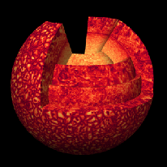
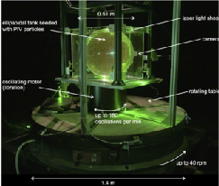
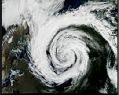
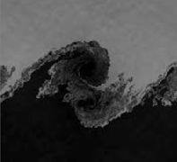
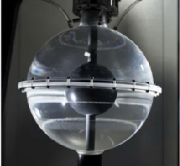
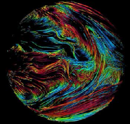

+++
title = "Workshop Beyond Boussinesq (Lyon 2023)"
path = "workshop-2023-10"
template = "simplepage.html"
+++

# Beyond Boussinesq for Astrophysical and Geophysical fluids: Numerical tools and experiments of the future

**Chair Organisers**: Isabelle Baraffe (Exeter; CRAL-ENS Lyon) & Adrien Morison
(Exeter)

**Co-organisers**: Thierry Alboussiere (LGLTPE, Lyon), Stéphane Labrosse
(LGLTPE, Lyon), Michael Le Bars (IRPHE, Aix-Marseille), Michel Rieutord (IRAP,
Toulouse)

## General information

- 16-19 October 2023 (Monday to Thursday)
- At [École Normale Supérieure de
  Lyon](https://www.ens-lyon.fr/en/campus-life/campus-tour/maps-directions),
  Monod campus, Condorcet room
- Registration is now  closed (contact Isabelle Baraffe for information)
- [List of attendees](@/pages/workshop-2023-10/attendees.md)
- [Program](@/pages/workshop-2023-10/program.md)
- [Abstracts](@/pages/workshop-2023-10/abstracts.md)
- Lunches take place at Brasserie des Sciences, 46 allée d'Italie (very close
  to the Condorcet room), lunch is included for all registered participants
- Welcome cocktail on Monday 16 takes place at Salle des colloques, site ENS
  Descartes (10 min walk from the Condorcet room)
- Conference dinner on Wednesday 18 at 19:30, [Brasserie
  Georges](https://goo.gl/maps/iVKeTJmwRTbdZdiC9)

### Travelling to Lyon

- By air: the closest airport is Lyon Saint-Exupéry (LYS).
- By train: Lyon can be reached by fast train (TGV) from Paris (2h) and
  Marseille (1.5h) and by local train from surrounding cities (including
  Geneva, 2h). Train stations are Lyon Part-Dieu and Lyon Perrache.

### Getting to the campus

- From the airport: take the Rhonexpress train to Part-Dieu railway station.
- From Part-Dieu railway station:
  - exit at "Porte du Rhône";
  - take subway line B towards Oullins, exit at Debourg.
- From Perrache railway station:
  - take tram T1 towards Debourg, exit at Debourg.

### Hotels

We provide below a list of hotels which are convenient because they are close
to the venue:

- [Séjour & Affaires Gerland](https://www.sejours-affaires.com/residence-hoteliere-aparthotel-lyon-172.html)
- [Séjour & Affaires Saxe Gambetta](https://www.sejours-affaires.com/residence-hoteliere-aparthotel-lyon-21.html)
- [Hôtel Ibis Gerland Mérieux](https://all.accor.com/hotel/0477/index.en.shtml)
- [Novotel Gerland](https://all.accor.com/hotel/0736/index.en.shtml)

We would however recommend to book a hotel in the so-called Presqu’ile
of Lyon, between Perrache and Place des Terreaux:
- [Hotel Victoria Confluence](https://www.hotelvictorialyon.com)
- [Hotel des Savoies Lyon Perrache](https://www.hotel-des-savoies.fr)
- [Hotel des Célestins](https://www.hotelcelestins.com)
- [Globe & Cecil](https://globeetcecilhotel.com/en/)

## Synopsis

  

  

The goal of this workshop is to gather various experts in astrophysical and
geophysical fluid dynamics working on similar physical/hydrodynamical processes
but within different contexts (stars, planets, Earth mantle, ocean, atmosphere,
climate, etc) and facing similar numerical and/or experimental challenges.  The
main driver is to understand

1. the effects of compressibility for topical problems common to astrophysical
   and geophysical environments (convection, double-diffusive instabilities,
   waves);
2. the effects of deformation due to rotation in convective systems.

The spirit of the workshop is exploratory. The idea is to discuss possible
solutions for the development of numerical tools and experiments, which could
apply to a wide range of contexts and environments, in order to go beyond
current approaches.

Some of the questions we would like to address during this workshop are:

1. What are the limits of Boussinesq/anelastic approaches or other commonly
   used simplifications. Which problems critically need to go beyond these
   approximations?
2. Compressible codes: Can one use the same numerical tools for astrophysical
   and geophysical fluids? Do we need to develop new compressible numerical
   tools and which ones?
3. Which numerical and lab experiments can be done to understand the effects of
   compressibility?

We will have three sessions devoted to

1. convection;
2. double-diffusive convection;
3. gravity waves (and associated problems: transport of angular momentum, wave
   heating, chemical mixing, etc).

The questions above should be common to these sessions and should be the
guideline for the speakers. Additionally, we would like to address the related
topic of nonsphericity in rapidly rotating convective systems.

The sessions will address current numerical approaches and issues in stellar,
planetary (solar system planets) and Earth contexts and relevant laboratory
experiments, including high mach compressible flow experiments.
